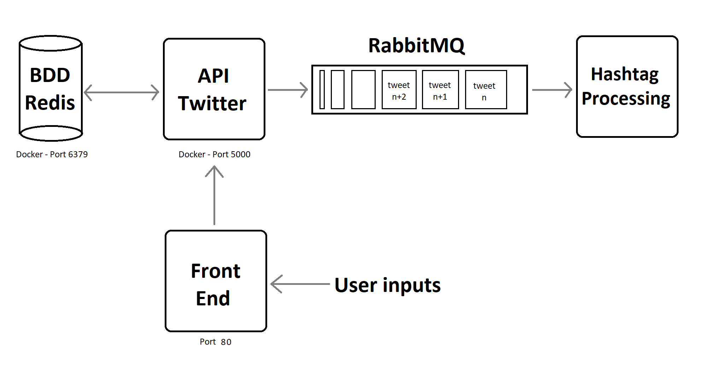

# **CLOUD COMPUTING PROJECT - General Overview**

*Realized by : HADJI Rayan, LATIFI Asmae - TP1 ILC 4A*

[](http://commonmark.org)

[](https://github.com/DZburst/4A_ILC_Cloud_Project/actions/workflows/build_app.yml)

Our GitHubs : 

<a href="url">[<br>HADJI Rayan](https://github.com/DZburst)</a>
<br>
<br>

<a href="url">[<br>LATIFI Asmae](https://github.com/Asmlatg)</a>
<br> 
<br> 

---

## Procedure for Code Execution :

  To start the application, please follow these steps :

  1. ```bash git clone https://github.com/DZburst/4A_ILC_Cloud_Project```
  2. ```bash pip install -r requirements.txt```
  3. ```bash docker run -p 6379:6379 --name myredis --rm redis```
  4. Run the **Python API**
  5. Go to the root of Back_End, and run ```bash docker build -t twitterapp .```
  6. Still in the root of Back_End, run ```bash docker run -p 5000:5000 twitterapp```
  7. Go to the root of Front_End, and run ```bash docker build -t frontend .```
  8. Still in the root of Front_End, run ```bash docker run -p 8080:80 twitterapp```
  9. You can now use your favorite browser to (re)discover Tweetyr, by opening the HTML file directly in the folder containing the directory clone.

  > Remark : Once logged in, the user credentials are stored in the browser's memory ; in order to sign off, please remove the cache in Application -> Local Storage on your web browser.


## Main Steps of the Project :

1. Started with the Endpoints, using dictionnaries as in the CI/CD Project
    - Creating all the routes corresponding to the functionnalities in the consigns
    - Taking care of the easiest ones at first, and modifying the others alongside the evolution of the code
    - Testing these endpoints manually and through the front-end when it was possible
2. Replaced the dictionnaries with a key-value database in [Redis](https://redis.io/)
    - Progressive removal of the values linked to the dictionnaries, to replace them with the *redis_client*
    - Keeping the dictionnary while still developping the main functionnalities in case of problem
3. Front-End done progressively with the usual HTML/CSS/JS
4. Configuration of the [Docker](https://www.docker.com/) contener, requirements, CIs etc...
5. Started adding the queue with [RabbitMQ](https://www.rabbitmq.com/), but unable to finish it on time ; we've included it in the architecture, but it isn't actually present.

## Microservice Architecture :


